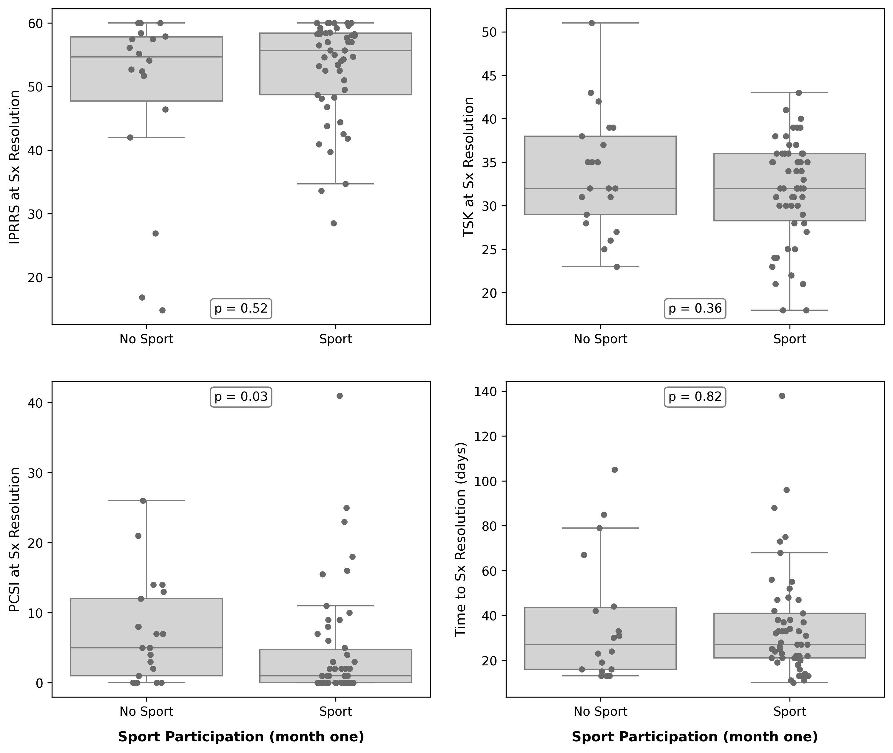
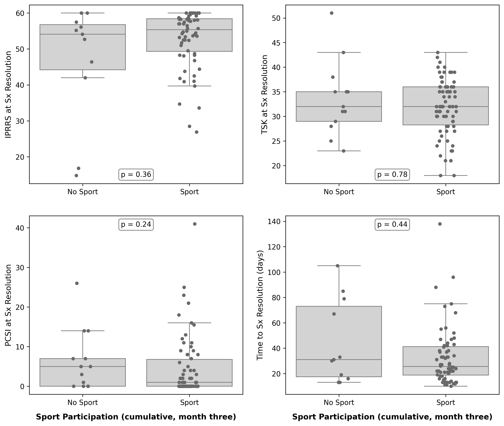
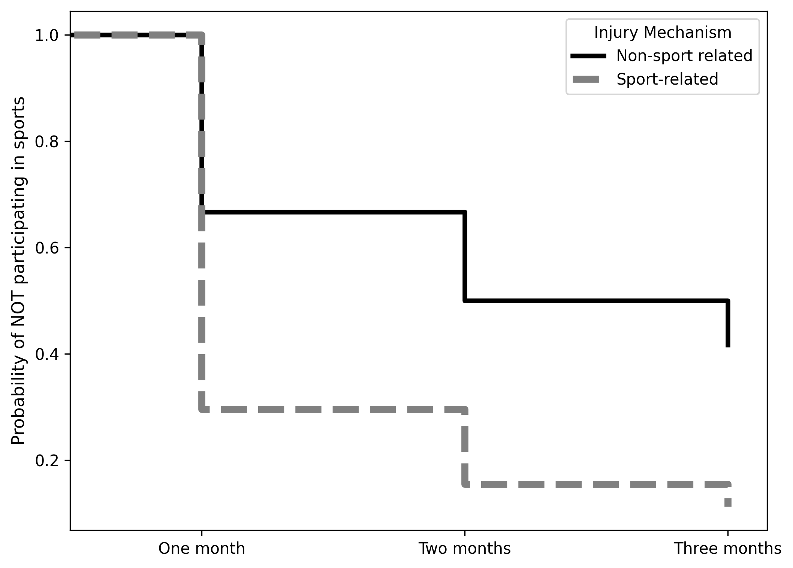

# Predicting return to sport after concussion symptom resolution: fear of movement, confidence, and physical function/mobility. 
Wingerson, MJ  
mat.wingerson@gmail.com

# Description 
Transparency of source code and results for a manuscript submitted to [journal tbd]. 

[Add citation when accepted]

---

# Overview

## Background:
Complete rehabilitation and recovery from concussion in an athlete population includes a successful reintegration to sport participation. The proportion of patients who participate in sports in the months that follow symptom resolution is unknown, as are the injury, recovery, or demographic characteristics that differentiate patients who do and do not return to sport participation soon after recovery. An improved understanding of such factors may inform clinicians in early identification of patients at risk of delayed sport participation and may reveal strategies for more successful sport reintegration in the future. 

## Objective:
Our **primary objective** was to describe sport participation among a sample of adolescents who were followed longitudinally from concussion to 3-months post-symptom resolution. 

Our **secondary objective** was to investigate clinical, injury, and demographic characteristics that differed among participants who did and did not report sport participation in the 1 to 3 months after injury. 

---

# Methods

## Study design:  

@Meghan - this is the MEDIC study, so you will need to describe the following: 
- Dates of enrollment
- Inclusion/Exclusion criteria
- Broadly, the timeline of study visits and monthly surveys
- A paragraph describing + citations for each of the variables we used in the study (IPRRS, TSK, PROMIS physical function)

## Statistical methods:

@Meghan: I will write this and add it to your draft manuscript, but here is an overview:

Given that our primary outcome was sport participation in the months after symptom resolution, self-reported by participants on the monthly surveys, we only include participants who completed at least one of the three monthly surveys. We used mean and standard deviation (M, sd) or group size and percent in group (n, %) to describe numeric and categorical variables, respectively. Non-plausible values for self-report variables were treated as missing; for example, two participants self-reported >160 hours per week of sport participation, despite a week only consisting of 168 hours in total. 

Our primary aim was to describe sport participation in the 3 months that follow concussion symptom resolution. The total number of hours - practices and games combined - that subjects reported participating in sport is reported as mean and standard deviation. Sport participation hours were also averaged across the 3 months within each subject and reported as mean and sd. We also report the number of sports that participants reported playing. 

Our secondary objective was to  investigate clinical, injury, and demographic characteristics that differed among participants who did and did not report sport participation in the 1 to 3 months after injury. We used a Shapiro-Wilk test to determine data normality. We first compared subjects who did and did not report sport participation at the 1-month post-symptom resolution timepoint. Wilcoxon Rank Sum tests compared numeric variables between these two groups. Chi-squared tests compared categorical variables. Next, we compared subjects who did and did not report sport participation at any point in the 3-month post-symptom resolution monitoring period. The same statistical tests were used for between-group comparisons. 

Last, we constructed a Cox Proportional Hazards model to evaluate the hazard of sport participation during the 3 months after symptom resolution. The predictor variables for this model were any demographic, clinical, or injury characteristics that significantly differed between subjects participating in sports at 1-month and those who were not. 

---

# Results

## Sample demographics and such:
A total of 83 subjects were at least 3 months post-symptom resolution and had completed at least one monthly survey in that time. 

**Table 1:** @Meghan, here is a basic table 1 demographics that you can include in your paper. 
|                                         |      | Missing   | Overall        |
|-----------------------------------------|------|-----------|----------------|
| n                                       |      |           | 83             |
| doi_to_v1, mean (SD)                    |      | 0         | 13.07 (4.62)   |
| doi_to_sxresolution, mean (SD)          |      | 4         | 34.37 (24.38)  |
| fivep_sex, n (%)                        | 0    |           | 40 (48.19)     |
|                                         | 2    |           | 43 (51.81)     |
| age_visit, mean (SD)                    |      | 0         | 15.72 (1.47)   |
| race___0, n (%)                         | 0    |           | 80 (96.39)     |
|                                         | 1    |           | 3 (3.61)       |
| race___1, n (%)                         | 0    |           | 81 (97.59)     |
|                                         | 1    |           | 2 (2.41)       |
| race___2, n (%)                         | 0    |           | 74 (89.16)     |
|                                         | 1    |           | 9 (10.84)      |
| race___3, n (%)                         | 0    |           | 83 (100.00)    |
| race___4, n (%)                         | 0    |           | 11 (13.25)     |
|                                         | 1    |           | 72 (86.75)     |
| race___6, n (%)                         | 0    |           | 78 (93.98)     |
|                                         | 1    |           | 5 (6.02)       |
| ethnicity, n (%)                        | 0.0  |           | 14 (16.87)     |
|                                         | 1.0  |           | 63 (75.90)     |
|                                         | 2.0  |           | 5 (6.02)       |
|                                         | None |           | 1 (1.20)       |
| pcsi_initial, mean (SD)                 |      | 0         | 37.94 (21.26)  |
| sx_to_m1, mean (SD)                     |      | 22        | 48.07 (13.14)  |
| sx_to_m2, mean (SD)                     |      | 20        | 76.37 (10.32)  |
| sx_to_m3, mean (SD)                     |      | 33        | 108.04 (13.06) |
**Time to symptom resolution range: 10-138 days*

## Primary objective: 

Participation in sports was reported by 65.1% of subjects (n=54) in month one after symptom resolution, and by 61.5% (n=51) and 48.2% (n=40) of subjects in months two and three post-symptom resolution, although survey non-response rates also increased each month. Cumulatively, by month one 65.06% of subjects (n=54) had reported sport participation, by month two 79.52% (n=66) had reported sport participation at some point in the previous two months, and by month three 84.34% (n=70) had reported sport participation at some point in the previous three months. Sport participation rates and hours of participation are reported in Table 2. 

**Table 2:** Sport participation rates and hours of participation, as self-reported on monthly surveys one, two, and three months after concussion symptom resolution. 
|                                         |      | Missing   | Overall        |
|-----------------------------------------|------|-----------|----------------|
| n                                       |      |           | 83             |
| sports_partic_yn_1, n (%)               | 0.0  |           | 21 (25.30)     |
|                                         | 1.0  |           | 54 (65.06)     |
|                                         | None |           | 8 (9.64)       |
| sports_partic_yn_2, n (%)               | 0.0  |           | 21 (25.30)     |
|                                         | 1.0  |           | 51 (61.45)     |
|                                         | None |           | 11 (13.25)     |
| sports_partic_yn_3, n (%)               | 0.0  |           | 17 (20.48)     |
|                                         | 1.0  |           | 40 (48.19)     |
|                                         | None |           | 26 (31.33)     |
| number_sports_1, n (%)                  | 1.0  |           | 47 (56.63)     |
|                                         | 2.0  |           | 4 (4.82)       |
|                                         | 3.0  |           | 2 (2.41)       |
|                                         | None |           | 30 (36.14)     |
| number_sports_2, n (%)                  | 1.0  |           | 37 (44.58)     |
|                                         | 2.0  |           | 10 (12.05)     |
|                                         | 3.0  |           | 1 (1.20)       |
|                                         | 4.0  |           | 2 (2.41)       |
|                                         | None |           | 33 (39.76)     |
| number_sports_3, n (%)                  | 1.0  |           | 34 (40.96)     |
|                                         | 2.0  |           | 5 (6.02)       |
|                                         | 3.0  |           | 1 (1.20)       |
|                                         | None |           | 43 (51.81)     |
| total_hrs_1, mean (SD)                  |      | 30        | 33.33 (46.65)  |
| total_hrs_2, mean (SD)                  |      | 33        | 36.29 (34.58)  |
| total_hrs_3, mean (SD)                  |      | 43        | 40.73 (39.16)  |
| avg_hrs_total, mean (SD)                |      | 14        | 35.26 (31.53)  |

The cumulative percentage of subjects participating in sports and hours of sport participation are shown in Figure 1. Average hours of sport participation across all three months is shown in Figure 2. 

**Figure 1:** Cumulative percent of subjects who have reported participating in sports at some point by months one, two, and three (grey dashed line). The average practice and game hours participating in sport for months one, two and three are also shown (black solid line). Note the different y-axes on the left and right sides of the plot, corresponding in color to their line plot. 

  

**Figure 2:** A smoothed kernel density plot showing the distribution of sport participation hours. The vertical dashed line represents the sample median. 

  

## Secondary objective: 

At month one after symptom resolution, n=58 subjects were participating in sport, n=23 were not, and n=8 did not complete the survey. Mean and standard deviation or n (%) are provided in Table 3 below. 

**Table 3:** Comparing those participating and not participating in sports at one month after symptom resolution. P-values reflect Wilcoxon Rank Sum tests or Chi Squared tests for between-group differences. 
|                                         |     | Missing   | Overall       |Not participating|Participating| P value|
|-----------------------------------------|-----|-----------|---------------|---------------|---------------| -------|
| n                                       |     |           | 81            | 23            | 58            |        |
| doi_to_sxresolution, mean (SD)          |     | 5         | 35.17 (24.34) | 35.75 (27.11) | 34.96 (23.54) | 0.6245 |
| age_visit, mean (SD)                    |     | 0         | 15.81 (1.51)  | 15.77 (1.55)  | 15.82 (1.50)  | 0.7693 |
| pcsi_sxresolution, mean (SD)            |     | 0         | 4.73 (7.58)   | 6.52 (7.23)   | 4.03 (7.66)   | 0.0566 |
| tsk_sxresolution, mean (SD)             |     | 0         | 31.91 (6.35)  | 33.30 (6.73)  | 31.36 (6.16)  | 0.4508 |
| promis_physfunc_sxresolution, mean (SD) |     | 0         | 0.86 (2.08)   | 1.48 (3.40)   | 0.62 (1.20)   | 0.5540 |
| iprrs_sxresolution, mean (SD)           |     | 8         | 51.89 (9.74)  | 49.29 (13.90) | 52.88 (7.56)  | 0.5991 |
| sx_to_m1, mean (SD)                     |     | 15        | 48.20 (13.10) | 48.06 (12.00) | 48.25 (13.61) | 0.6194 |
| fivep_sex, n (%)                        | 0.0 |           | 40 (49.38)    | 14 (60.87)    | 26 (44.83)    | 0.2911 |
|                                         | 2.0 |           | 41 (50.62)    | 9 (39.13)     | 32 (55.17)    |        |
| sports_yn, n (%)                        | 0.0 |           | 12 (14.81)    | 8 (34.78)     | 4 (6.90)      | 0.0045 |
|                                         | 1.0 |           | 69 (85.19)    | 15 (65.22)    | 54 (93.10)    |        |
| conc_hx_yn, n (%)                       | 0.0 |           | 39 (48.15)    | 14 (60.87)    | 25 (43.10)    | 0.2315 |
|                                         | 1.0 |           | 42 (51.85)    | 9 (39.13)     | 33 (56.90)    |        |
| mskinjury_hx_yn, n (%)                  | 0.0 |           | 29 (35.80)    | 11 (47.83)    | 18 (31.03)    | 0.2443 |
|                                         | 1.0 |           | 52 (64.20)    | 12 (52.17)    | 40 (68.97)    |        |

|                                         |    | Missing   | Overall       |Not participating|Participating|
|-----------------------------------------|----|-----------|---------------|---------------|---------------|
| n                                       |    |           | 75            | 21            | 54            |
| doi_to_sxresolution, mean (SD)          |    | 4         | 35.58 (25.07) | 37.11 (28.23) | 35.06 (24.17) |
| age_visit, mean (SD)                    |    | 0         | 15.78 (1.47)  | 15.79 (1.47)  | 15.78 (1.48)  |
| pcsi_sxresolution, mean (SD)            |    | 0         | 5.06 (7.78)   | 7.14 (7.27)   | 4.25 (7.89)   |
| tsk_sxresolution, mean (SD)             |    | 0         | 32.25 (6.24)  | 33.81 (6.77)  | 31.65 (5.97)  |
| promis_physfunc_sxresolution, mean (SD) |    | 0         | 0.69 (1.38)   | 0.90 (1.76)   | 0.61 (1.22)   |
| iprrs_sxresolution, mean (SD)           |    | 8         | 51.76 (10.09) | 48.91 (14.50) | 52.81 (7.84)  |
| sx_to_m1, mean (SD)                     |    | 14        | 48.07 (13.14) | 47.12 (10.68) | 48.40 (14.01) |
| fivep_sex, n (%)                        | 0  |           | 35 (46.67)    | 13 (61.90)    | 22 (40.74)    |
|                                         | 2  |           | 40 (53.33)    | 8 (38.10)     | 32 (59.26)    |
| sports_yn, n (%)                        | 0  |           | 12 (16.00)    | 8 (38.10)     | 4 (7.41)      |
|                                         | 1  |           | 63 (84.00)    | 13 (61.90)    | 50 (92.59)    |
| conc_hx_yn, n (%)                       | 0  |           | 36 (48.00)    | 12 (57.14)    | 24 (44.44)    |
|                                         | 1  |           | 39 (52.00)    | 9 (42.86)     | 30 (55.56)    |
| mskinjury_hx_yn, n (%)                  | 0  |           | 28 (37.33)    | 11 (52.38)    | 17 (31.48)    |
|                                         | 1  |           | 47 (62.67)    | 10 (47.62)    | 37 (68.52)    |

**Figure 3:** Box plots showing the median and IQR between those who are and are not participating in sports at month one after symptom resolution. 
  

--- 

At three months after symptom resolution, n=74 subjects had participated in sport (cumulative), n=15 had not, and n=0 failed to complete at least one survey in the three months. Mean and standard deviation or n (%) are provided in Table 4 below. 

**Table 4:** Comparing those participating and not participating in sports within three months of symptom resolution. P-values reflect Wilcoxon Rank Sum tests or Chi Squared tests for between-group differences. 
|                                         |     | Missing   | Overall       | 0             | 1             | p-value |
|-----------------------------------------|-----|-----------|---------------|---------------|---------------| ------- |
| n                                       |     |           | 89            | 15            | 74            | 
| doi_to_sxresolution, mean (SD)          |     | 5         | 34.07 (23.73) | 41.38 (31.37) | 32.73 (22.08) | 0.6517  |
| age_visit, mean (SD)                    |     | 0         | 15.75 (1.50)  | 16.04 (1.70)  | 15.69 (1.47)  | 0.4865  | 
| pcsi_sxresolution, mean (SD)            |     | 0         | 4.48 (7.36)   | 5.47 (7.45)   | 4.28 (7.37)   | 0.4628  |
| tsk_sxresolution, mean (SD)             |     | 0         | 31.88 (6.17)  | 32.80 (7.28)  | 31.69 (5.96)  | 0.9956  |
| promis_physfunc_sxresolution, mean (SD) |     | 0         | 0.92 (2.15)   | 1.93 (3.99)   | 0.72 (1.50)   | 0.2409  |
| iprrs_sxresolution, mean (SD)           |     | 8         | 52.09 (9.47)  | 47.76 (15.23) | 52.92 (7.82)  | 0.3958  | 
| sx_to_m1, mean (SD)                     |     | 23        | 48.20 (13.10) | 48.92 (14.03) | 48.04 (13.02) | 0.5776  | 
| fivep_sex, n (%)                        | 0.0 |           | 45 (50.56)    | 9 (60.00)     | 36 (48.65)    | 0.6040  | 
|                                         | 2.0 |           | 44 (49.44)    | 6 (40.00)     | 38 (51.35)    |         | 
| sports_yn, n (%)                        | 0.0 |           | 12 (13.48)    | 5 (33.33)     | 7 (9.46)      | 0.0400  | 
|                                         | 1.0 |           | 77 (86.52)    | 10 (66.67)    | 67 (90.54)    |         |
| conc_hx_yn, n (%)                       | 0.0 |           | 44 (49.44)    | 9 (60.00)     | 35 (47.30)    | 0.5392  |
|                                         | 1.0 |           | 45 (50.56)    | 6 (40.00)     | 39 (52.70)    |         |
| mskinjury_hx_yn, n (%)                  | 0.0 |           | 32 (35.96)    | 6 (40.00)     | 26 (35.14)    | 0.9498  |
|                                         | 1.0 |           | 57 (64.04)    | 9 (60.00)     | 48 (64.86)    |         |

**Figure 4:** Box plots showing the median and IQR between those who are and are not participating in sports at month one after symptom resolution. 
  

---

Last, we constructed a Cox Proportional Hazards model to evaluate how sport-related injury mechanism and PCSI score at symptom resolution were associated with the hazard of sport participation in the three months after concussion symptoms had resolved. We found that the hazard of sport participation was significantly higher among subjects with a sport-related mechanism of injury (HR: 2.37; 95% CI: 1.07, 5.24; p-value: 0.03). Those who sustained their injury in sports had 2.37 times the likelihood of earlier participation in sports during the three months following symptom resolution, compared to those who did not sustain injury during sports. PCSI score was not significantly associated with hazard of sport participation (HR: 0.99; 95% CI: 0.96, 1.03; p-value: 0.76). 

**Figure 5:** Kaplan Meier curve showing the probability of returing to sport participation by month after concussion symptom resolution. 
  

---

Add DOI to M1 and look at clearance to rtp

Add median and p-values to final box plots

try Cox PH for target vars
