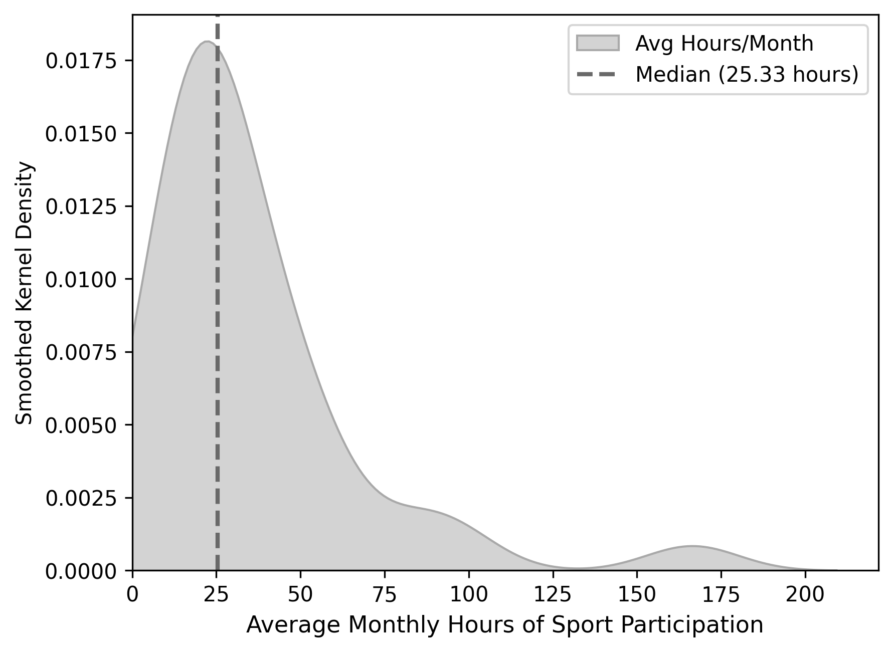

# Predicting return to sport after concussion symptom resolution: fear of movement, confidence, and physical function/mobility. 
Wingerson, MJ  
mat.wingerson@gmail.com

# Description 
Transparency of source code and results for a manuscript submitted to [journal tbd]. 

[Add citation when accepted]

---

# Overview

## Background:
Complete rehabilitation and recovery from concussion in an athlete population includes a successful reintegration to sport participation. The proportion of patients who participate in sports in the months that follow symptom resolution is unknown, as are the injury, recovery, or demographic characteristics that differentiate patients who do and do not return to sport participation soon after recovery. An improved understanding of such factors may inform clinicians in early identification of patients at risk of delayed sport participation and may reveal strategies for more successful sport reintegration in the future. 

## Objective:
Our **primary objective** was to describe sport participation among a sample of adolescents who were followed longitudinally from concussion to 3-months post-symptom resolution. 

Our **secondary objective** was to investigate clinical, injury, and demographic characteristics that differed among participants who did and did not report sport participation in the 1 to 3 months after injury. 

---

# Methods

## Study design:  

@Meghan - this is the MEDIC study, so you will need to describe the following: 
- Dates of enrollment
- Inclusion/Exclusion criteria
- Broadly, the timeline of study visits and monthly surveys
- A paragraph describing + citations for each of the variables we used in the study (IPRRS, TSK, PROMIS physical function)

## Statistical methods:

I will write this and add it to your draft manuscript, but here is an overview:

Given that our primary outcome was sport participation in the months after symptom resolution, self-reported by participants on the monthly surveys, we only include participants who completed at least one of the three monthly surveys. We used mean and standard deviation (M, sd) or group size and percent in group (n, %) to describe numeric and categorical variables, respectively. Non-plausible values for self-report variables were treated as missing; for example, two participants self-reported >160 hours per week of sport participation, despite a week only consisting of 168 hours in total. 

Our primary aim was to describe sport participation in the 3-months that follow concussion symptom resolution. The total number of hours - practices and games combined - that subjects reported participating in sport are reported as mean and standard deviation. Sport participation hours were also averaged across the 3-month period within each subject and reported as mean and sd. We also report the number of sports that participants reported playing as 1 or >=2. 

Our secondary objective was to  investigate clinical, injury, and demographic characteristics that differed among participants who did and did not report sport participation in the 1 to 3 months after injury. We used a Shapiro-Wilk test to determine data normality. We first compared subjects who did and did not report sport participation at the 1-month post-symptom resolution timepoint. Wilcoxon Rank Sum tests compared numeric variables between these two groups. Chi-squared tests compared categorical variables. Next, we compared subject who did and did not report sport participation at any point in the 3-month post-symptom resolution monitoring period. The same statistical tests were used for between-group comparisons. 

Last, we constructed a Cox Proportional Hazards model to evaluate the hazard of sport participation during the 3-months after symptom resolution. The predictor variables for this model were any demographic, clinical, or injury characteristics that significantly differed between subjects participating in sports at 1-month and those who were not. 

---

# Results

## Sample demographics and such:
The trial enrolled 132 subjects, with 89 being at least 3-months post-symptom resolution and having completed at least one monthly survey in that time. The average time to study enrollment after concussion was 13.1 (4.5) days. The average time to symptom resolution was 34.1 (23.7) days, with a range of 10 to 138 days. The mean sample age was 15.8 (1.5) years and 49% (n=44) were female biological sex. Remaining demographics are reported in Table 1. 

**Table 1:** @Meghan, here is a basic table 1 demographics that you can include in your paper. 
|                                         |      | Missing   | Overall        |
|-----------------------------------------|------|-----------|----------------|
| n                                       |      |           | 89             |
| doi_to_v1, mean (SD)                    |      | 0         | 13.13 (4.52)   |
| doi_to_sxresolution, mean (SD)          |      | 5         | 34.07 (23.73)  |
| fivep_sex, n (%)                        | 0.0  |           | 45 (50.56)     |
|                                         | 2.0  |           | 44 (49.44)     |
| age_visit, mean (SD)                    |      | 0         | 15.75 (1.50)   |
| race___0, n (%)                         | 0    |           | 85 (95.51)     |
|                                         | 1    |           | 4 (4.49)       |
| race___1, n (%)                         | 0    |           | 87 (97.75)     |
|                                         | 1    |           | 2 (2.25)       |
| race___2, n (%)                         | 0    |           | 80 (89.89)     |
|                                         | 1    |           | 9 (10.11)      |
| race___3, n (%)                         | 0    |           | 89 (100.00)    |
| race___4, n (%)                         | 0    |           | 12 (13.48)     |
|                                         | 1    |           | 77 (86.52)     |
| race___6, n (%)                         | 0    |           | 84 (94.38)     |
|                                         | 1    |           | 5 (5.62)       |
| ethnicity, n (%)                        | 0.0  |           | 15 (16.85)     |
|                                         | 1.0  |           | 68 (76.40)     |
|                                         | 2.0  |           | 5 (5.62)       |
|                                         | None |           | 1 (1.12)       |
| pcsi_initial, mean (SD)                 |      | 0         | 37.45 (21.26)  |
| sx_to_m1, mean (SD)                     |      | 23        | 48.20 (13.10)  |
| sx_to_m2, mean (SD)                     |      | 23        | 76.23 (10.15)  |
| sx_to_m3, mean (SD)                     |      | 39        | 108.04 (13.06) |

## Primary objective: 

Participation in sports was reported by 65.2% of subjects (n=58) in month one after symptom resolution, and by 59.6% (n=53) and 44.9% (of subjects in months two and three post-symptom resolution, although survey non-response rates also increased each month. Cumulatively, by month one 65.17% of subjects (n=58) had reported sport participation, by month two 78.65% (n=70) had reported sport participation at some point in the previous two months, and by month three 83.15% (n=74) had reported sport participation at some point in the previous three months. Sport participation rates and hours of participation are reported in Table 2. 

**Table 2:** Sport participation rates and hours of participation, as self-reported on monthly surveys one, two, and three months after concussion symptom resolution. 
|                                         |      | Missing   | Overall        |
|-----------------------------------------|------|-----------|----------------|
| n                                       |      |           | 89             |
| sports_partic_yn_1, n (%)               | 0.0  |           | 23 (25.84)     |
|                                         | 1.0  |           | 58 (65.17)     |
|                                         | None |           | 8 (8.99)       |
| sports_partic_yn_2, n (%)               | 0.0  |           | 22 (24.72)     |
|                                         | 1.0  |           | 53 (59.55)     |
|                                         | None |           | 14 (15.73)     |
| sports_partic_yn_3, n (%)               | 0.0  |           | 17 (19.10)     |
|                                         | 1.0  |           | 40 (44.94)     |
|                                         | None |           | 32 (35.96)     |
| number_sports_1, mean (SD)              |      | 32        | 1.16 (0.45)    |
| number_sports_2, mean (SD)              |      | 37        | 1.35 (0.71)    |
| number_sports_3, mean (SD)              |      | 49        | 1.18 (0.45)    |
| number_sports_1, n (%)                  | 1.0  |           | 50 (56.18)     |
|                                         | 2.0  |           | 5 (5.62)       |
|                                         | 3.0  |           | 2 (2.25)       |
|                                         | None |           | 32 (35.96)     |
| number_sports_2, n (%)                  | 1.0  |           | 39 (43.82)     |
|                                         | 2.0  |           | 10 (11.24)     |
|                                         | 3.0  |           | 1 (1.12)       |
|                                         | 4.0  |           | 2 (2.25)       |
|                                         | None |           | 37 (41.57)     |
| number_sports_3, n (%)                  | 1.0  |           | 34 (38.20)     |
|                                         | 2.0  |           | 5 (5.62)       |
|                                         | 3.0  |           | 1 (1.12)       |
|                                         | None |           | 49 (55.06)     |
| total_hrs_1, mean (SD)                  |      | 34        | 25.32 (18.58)  |
| total_hrs_2, mean (SD)                  |      | 38        | 32.49 (21.59)  |
| total_hrs_3, mean (SD)                  |      | 51        | 33.56 (23.47)  |
| avg_hrs_total, mean (SD)                |      | 18        | 31.13 (21.66)  |

Cumulative percentage of subjects participating in sports and hours of sport participation are shown in Figure 1. Average hours of sport participation across all three months is shown in Figure 2. 

**Figure 1:** Cumulative percent of subjects who have reported participating in sports at some point by months one, two, and three (grey dashed line). The average practice and game hours participating in sport for months one, two and three are also shown (black solid line). Note the different y-axes on the left and right sides of the plot, corresponding in color to their line plot. 

  

**Figure 2:** A smoothed kernel density plot showing the distribution of sport participation hours. The vertical dahsed line represents the sample median. 

  

## Secondary objective: 

Group differences between month one sport participation

Group differences between cumulative sport participation

KM curve predicting time to sport participation

---

Try with and without 160hr people included

Try with and without those <3-months post-sxres ('3_mo_sxres')
